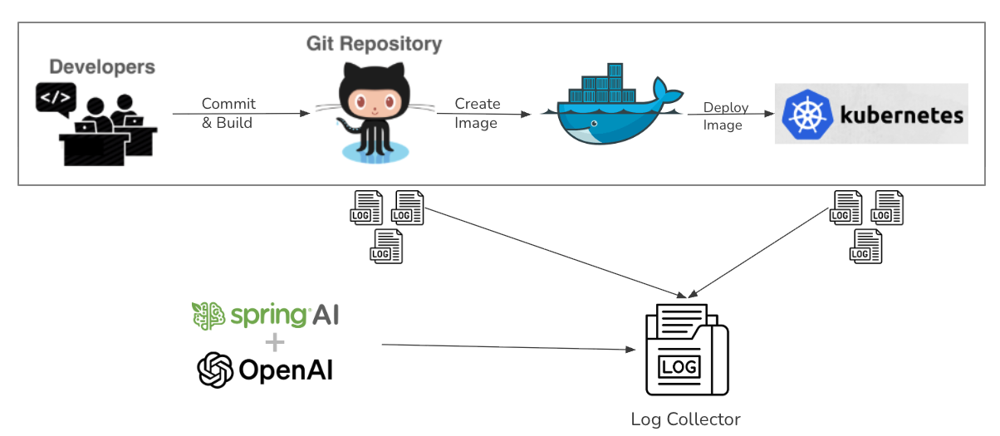
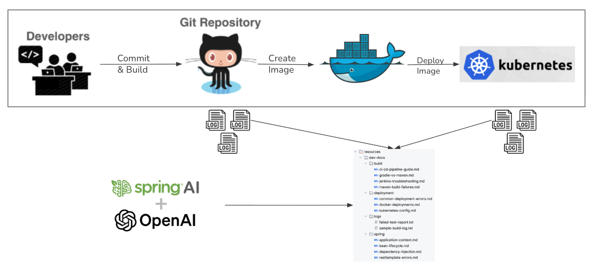
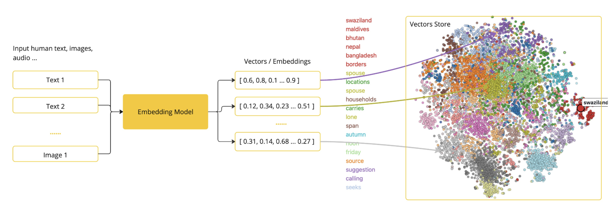
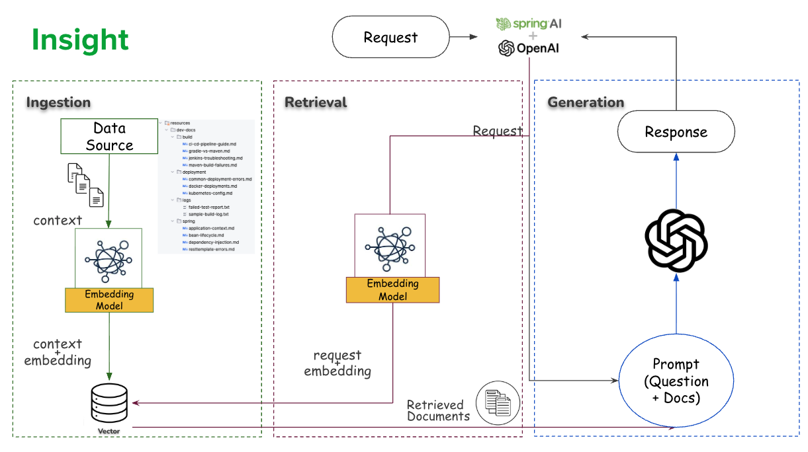

# Introduce Vector Store with Chat Memory

## Objective

Add log-based context search (RAG) using embeddings.



For our vector store, we'll use the `SimpleVectorStore` which stores vectors in-memory. For production use cases, consider using a persistent vector store like Pinecone, Weaviate, or others supported by Spring AI.



What is Vector Store:


How Vector Store Works:


## pom.xml

```xml

<dependency>
  <groupId>org.springframework.ai</groupId>
  <artifactId>spring-ai-vector-store</artifactId>
</dependency>
```

## Vector Configuration

```java
package com.example.spring_ai_demo.config;

import org.springframework.ai.embedding.EmbeddingModel;
import org.springframework.ai.vectorstore.SimpleVectorStore;
import org.springframework.ai.vectorstore.VectorStore;
import org.springframework.context.annotation.Bean;
import org.springframework.context.annotation.Configuration;

@Configuration
public class VectorConfig {

  @Bean
  public VectorStore vectorStore(EmbeddingModel embeddingModel) {
    return SimpleVectorStore.builder(embeddingModel).build();
  }
}
```

## Load logs

Copy the dev-docs folder into your src/main/resources directory.
See [dev-docs](../dev-docs) for the actual folder location.

```java
package com.example.spring_ai_demo.service;

import java.io.IOException;
import java.nio.file.Files;
import java.nio.file.Path;
import java.util.ArrayList;
import java.util.List;
import java.util.Map;
import org.slf4j.Logger;
import org.slf4j.LoggerFactory;
import org.springframework.ai.document.Document;
import org.springframework.ai.vectorstore.VectorStore;
import org.springframework.boot.CommandLineRunner;
import org.springframework.core.io.ClassPathResource;
import org.springframework.stereotype.Component;

@Component
public class LogLoader implements CommandLineRunner {

  private static final Logger log = LoggerFactory.getLogger(LogLoader.class);
  private final VectorStore vectorStore;

  private static final String DOCS_FOLDER = "dev-docs";

  public LogLoader(VectorStore vectorStore) {
    this.vectorStore = vectorStore;
  }

  @Override
  public void run(String... args) {
    List<Document> docs = loadDocuments();
    if (!docs.isEmpty()) {
      vectorStore.add(docs);
      System.out.println("✅ Loaded " + docs.size() + " documents into Vector Store.");
    } else {
      System.err.println("⚠️ No documents found in " + DOCS_FOLDER);
    }
    log.info("✅ Vector store populated successfully.");
  }


  private List<Document> loadDocuments() {
    List<Document> documents = new ArrayList<>();
    ClassPathResource folderResource = new ClassPathResource(DOCS_FOLDER);
    Path folderPath = null;
    try {
      folderPath = folderResource.getFile().toPath();
    } catch (IOException e) {
      log.error("Failed to load folder {}", DOCS_FOLDER, e);
    }

    try {
      assert folderPath != null;
      Files.walk(folderPath)
          .filter(Files::isRegularFile)
          .forEach(path -> {
            try {
              String content = Files.readString(path);
              documents.add(new Document(content,
                  Map.of("filename", path.getFileName().toString()
                  )));
            } catch (IOException e) {
              log.error("Failed to load file {}", path.getFileName().toString(), e);
            }
          });
    } catch (IOException e) {
      log.error("Failed to load folder {}", DOCS_FOLDER, e);
    }
    return documents;
  }
}

```

## Update Controller to include context
Add VectorStore and it's import:
```java
import org.springframework.ai.vectorstore.VectorStore;
```

```java
private final VectorStore vectorStore;
public AIController(ChatClient chatClient, ChatMemory chatMemory, VectorStore vectorStore) {
  this.chatClient = chatClient;
  this.chatMemory = chatMemory;
  this.vectorStore = vectorStore;
}
```


Add import related to VectorStore:
```java
import org.springframework.ai.document.Document;
import org.springframework.ai.vectorstore.SearchRequest;
import java.util.List;
import java.util.stream.Collectors;
```

```java
public String ask(@PathVariable String sessionId, @RequestBody Map<String, String> request) {
  String message = request.get("message");

  // Retrieve chat history
  var history = chatMemory.get(sessionId);

  // Perform similarity search in vector store
  List<Document> docs = vectorStore.similaritySearch(SearchRequest.builder()
      .query(message).topK(5).build());
  String context = docs.stream().map(Document::getText).collect(Collectors.joining("\n---\n"));

  // Load the prompt template from the resource
  PromptTemplate template = new PromptTemplate(promptTemplate);
  var prompt = template.create(Map.of("history", history, "context", context, "message", message));

  //Given tools definition here to Model along with Memory and Context
  String response = chatClient.prompt(prompt)
      .advisors(advisorSpec -> advisorSpec.param("conversationId", sessionId)).call().content();

  // Update chat memory
  chatMemory.add(sessionId, new UserMessage(message));
  assert response != null;
  chatMemory.add(sessionId, new SystemMessage(response));
  return response;
}
  ```

## Change the prompt template
`src/main/resources/prompt/build-analysis.st`
```
You are a CI/CD assistant that analyzes build, test, and deployment issues using the provided context from log files along with chat history.

Respond ONLY in JSON:
response: short explanation
root_cause: detailed cause
recommendation: list of fixes
severity: [critical, warning, info]
related_files: list of affected files

Conversation history (if any):
{history}

Relevant context from logs or documents (if any, with filenames):
{context}

Note: When forming "related_files", prefer filenames mentioned above (e.g., from File: ... sections).

Question:
{message}

Guidelines:
- Always return valid JSON (no Markdown).
- Keep recommendations clear and practical.
```


## Test
```bash
curl -X POST http://localhost:8080/ask/123 -H "Content-Type: application/json" -d '{"message":"Why did my backend build fail"}'
```
```bash
curl -X POST http://localhost:8080/ask/123 -H "Content-Type: application/json" -d '{"message":"Which test exactly failed"}'
```
```bash
curl -X POST http://localhost:8080/ask/123 -H "Content-Type: application/json" -d '{"message":"Can you summarize all failures in the last Jenkins pipeline?"}'
```
```bash
curl -X POST http://localhost:8080/ask/123 -H "Content-Type: application/json" -d '{"message":"How can I fix the NullPointerException?"}'
```
```bash
curl -X POST http://localhost:8080/ask/123 -H "Content-Type: application/json" -d '{"message":"Was the deployment successful?"}'
```


## Commit Changes to Git
After verifying the output, commit your changes:
```sh
git add src/main/java/com/example/spring_ai_demo/config/VectorConfig.java src/main/java/com/example/spring_ai_demo/service/LogLoader.java src/main/java/com/example/spring_ai_demo/controller/AIController.java src/main/resources/prompt/build-analysis.st
git commit -m "add vector store for log-based context search"
git push
```
